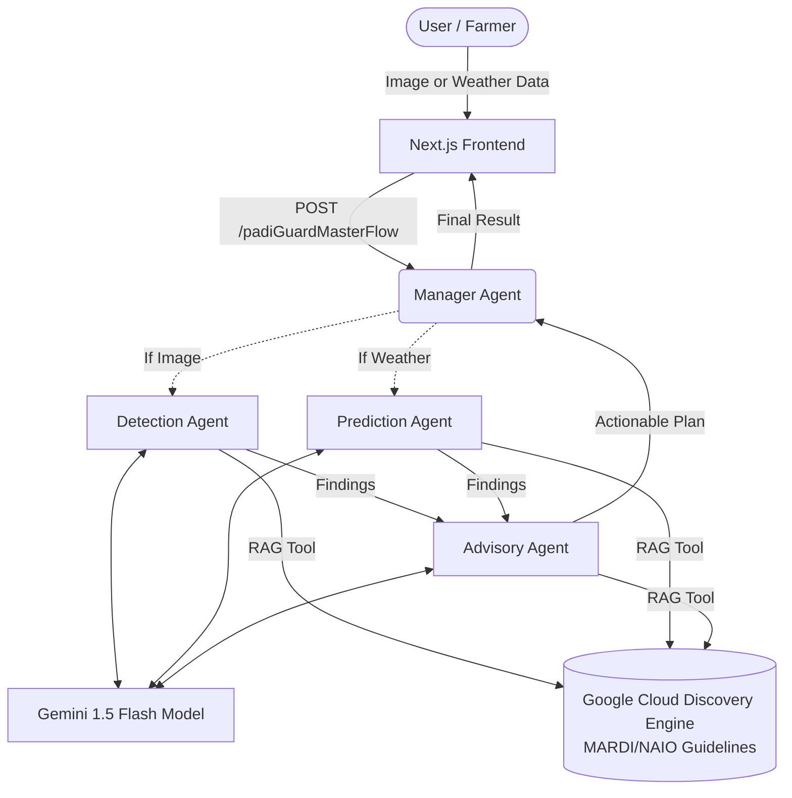

# 🌱 PadiGuard AI - Project 2030

PadiGuard AI is a multi-agent diagnostic system designed to safeguard Malaysian rice yields. Built using Google's Genkit framework, Gemini 1.5 Flash, and Next.js, it employs a 4-Agent Swarm architecture to interpret visual, text, and telemetry data. 

**Core Differentiator**: It heavily utilizes Sovereign RAG via Google Cloud Vector Search to ensure all diagnostic outputs and action plans strictly adhere to MARDI and Malaysian agricultural guidelines, eschewing generic or Western-centric advice.

## 🏗 System Architecture

The core of the system is the **4-Agent Swarm**:
1. **Manager Agent**: The central orchestrator routing requests and chaining responses.
2. **Detection Agent (The Eye)**: Specializes in multimodal computer vision for identifying plant diseases from user-uploaded images.
3. **Prediction Agent (The Oracle)**: Anticipates outbreaks using localized telemetry (Temp/Humidity) and cross-referencing Vector Search historical data.
4. **Advisory Agent (The Strategist)**: Translates the technical pathogen reports into actionable 3-step plans for local farmers (Pesawah).



## 🚀 Getting Started (Local Development)

The frontend interfaces directly with the Genkit development server over HTTP for rapid testing.

### Prerequisites
- Node.js 20+
- Google Cloud Project with Billing Enabled.
- Genkit CLI installed: `npm i -g genkit`
- Active Firebase Project.

### 1. Setup Environment Variables
Inside the `functions/` directory, create a `.env` file based on `.env.example` (if missing):
```env
# /functions/.env
GOOGLE_GENAI_API_KEY="your-gemini-api-key"
GCLOUD_PROJECT="myai-padiguard-ai-2030"
DATA_STORE_ID="padiguard-knowledge-engine_123456"
```

### 2. Start the Backend (Genkit 4-Agent Swarm)
Open a terminal, navigate to the `functions` directory, and start the Genkit development server.
```bash
cd functions
npm install
npm run build
genkit start -- tsx --watch src/index.ts
```
*(By default, the Genkit Flow API server launches on `localhost:3400` or `localhost:4000` depending on your CLI params. Ensure it matches the port targeted in the `frontend/app/page.tsx` fetch call (default `4000` for this project demo).)*

### 3. Start the Frontend (Next.js)
Open a **second** terminal, navigate to the frontend directory:
```bash
cd frontend
npm install
npm run dev
```
Visit `localhost:3000` in your web browser. You will see the **Modern Agrotech** interface and be able to test both the *Diagnosis Imej* and *Ramalan Cuaca* tabs.

## ⚙️ Features
*   **Graceful Degradation**: If an uploaded image is blurry (Certainty Score < 70%), the Detection Agent politely responds in Bahasa Melayu, asking for a clearer photo.
*   **Sovereign RAG Enforcement**: Uses Google Cloud Discovery Engine. No generic or unverified pesticides are suggested.
*   **Strict Zod Input Validation**: Robust type safety in `index.ts` flows prevents bad data from reaching the LLMs.
*   **Beautiful UI**: Tailwind-powered interface inspired by earthy, lush agricultural themes.

## 📜 AI Disclosure & Ethical Compliance

In accordance with the Hackathon Code of Conduct, we disclose the following regarding the development and operation of PadiGuard AI:

### 1. AI-Generated Code & Assistance
This project was developed with the assistance of AI coding tools, including **Google Gemini** and **Antigravity (AI Coding Agent)**. While AI assisted in boilerplate generation, UI component structure, and logic optimization, the overall architecture, prompt engineering for the 4-Agent Swarm, and Sovereign RAG integration were designed and implemented by the team.

### 2. Responsible & Ethical AI
*   **Bias Mitigation**: We address AI bias by using **Sovereign RAG**. Instead of relying on general LLM knowledge which may be Western-centric, all advisory outputs are grounded in official **MARDI** and Malaysian agricultural guidelines.
*   **Privacy**: No personally identifiable information (PII) is required or stored. Analysis is performed on uploaded images of padi plants and localized weather data.
*   **Transparency**: The system provides "Certainty Scores" and strictly avoids guessing if data is insufficient (Graceful Degradation), ensuring farmers receive reliable and non-harmful advice.
*   **Accountability**: Every part of this codebase is understood by the team and can be defended during the judging process.